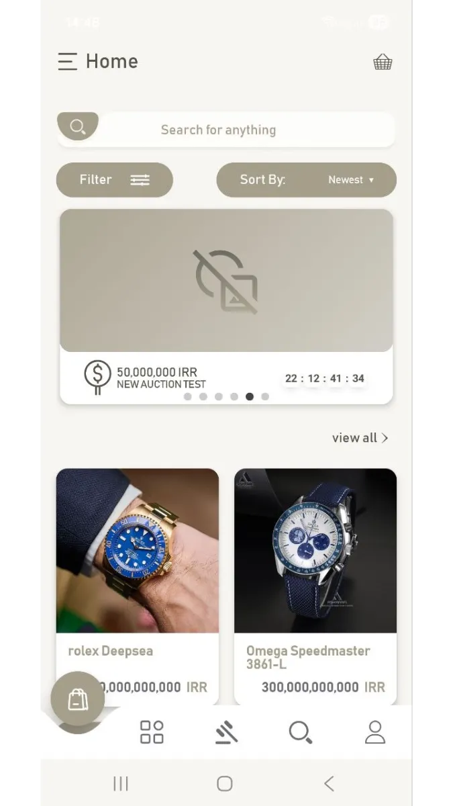
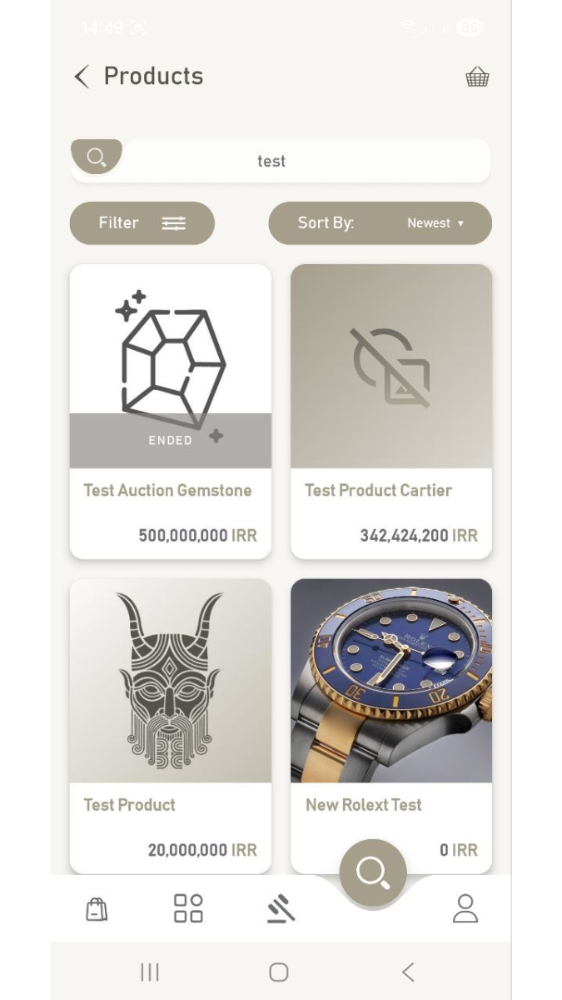
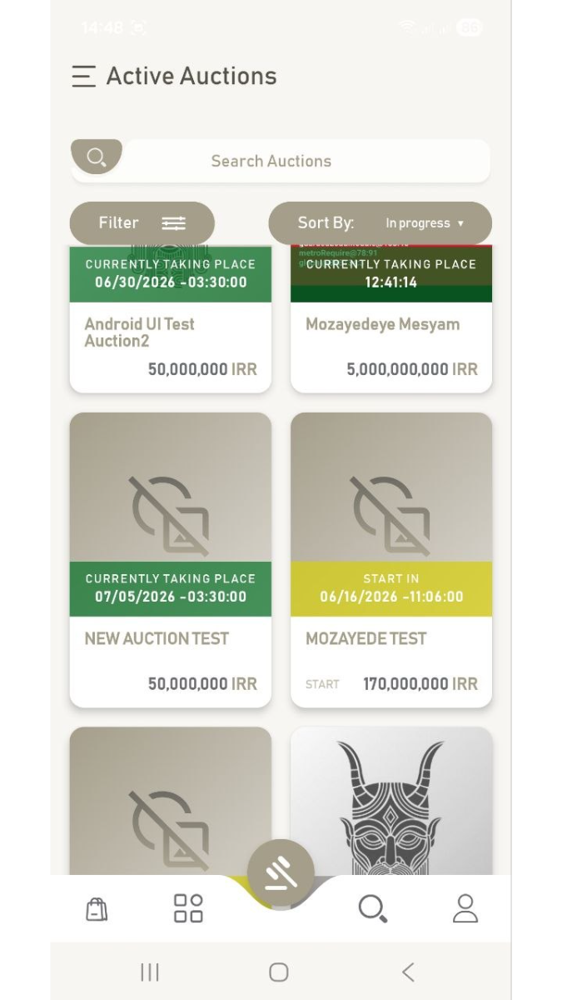
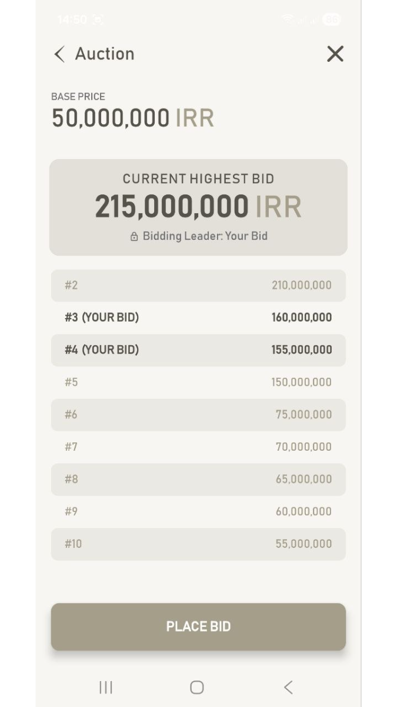
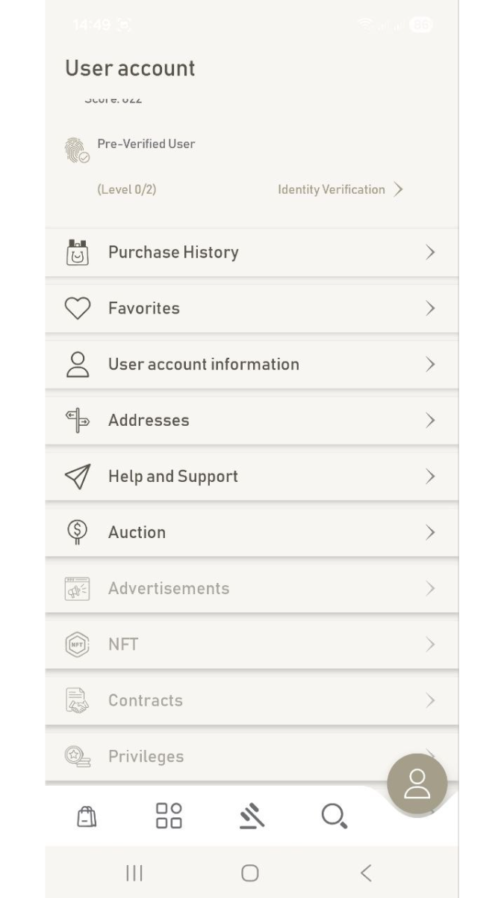
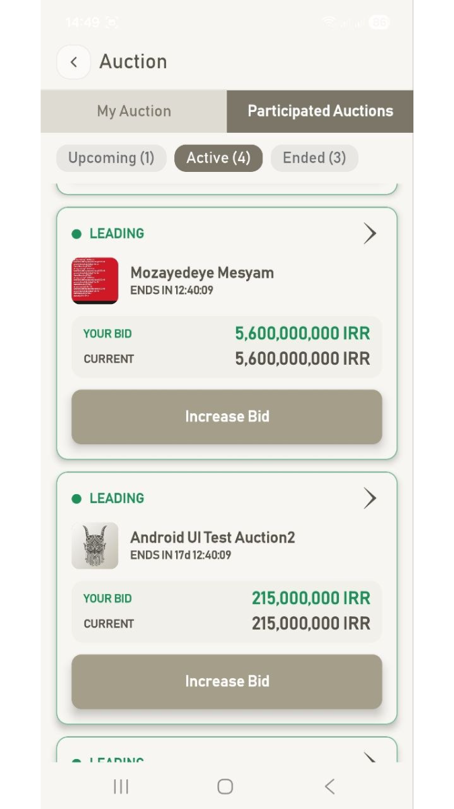

# It-K – Div

> **Status:** Active Employment | Startup | Private Codebase  
> **Tech Stack:** Node.js • NestJS • GraphQL • PostgreSQL • Redis • BullMQ • Elasticsearch • Docker • Linux • Nginx • GitHub Actions  
> **Role:** Backend Lead (3-person backend team) • Since Nov 2025

---

## Overview

It-K is a commerce and marketplace platform built around e-commerce, gradually expanding toward marketplace capabilities such as auctions, customer-owned listings, digital ownership, and AI-assisted workflows.

The platform includes support for multi-language and multi-currency commerce, multiple payment providers, auction-based trading, listing verification workflows, and future integrations involving crypto payments, NFT generation, AI-assisted contract generation, and computer vision services.

As Backend Lead, I have been responsible for designing and implementing core platform capabilities, driving architectural decisions, improving development workflows, documenting critical systems, and building deployment infrastructure.

---

## Key Contributions

### Platform Foundation

- Designed and implemented core commerce workflows including products, users, payments, localization, and currency handling.
- Evaluated and integrated existing solutions where appropriate, reducing implementation effort and accelerating delivery timelines.
- Contributed to platform architecture decisions with focus on maintainability, extensibility, and long-term scalability.

### Auctions & Marketplace Systems

- Designed and implemented auction workflows with transactional consistency, concurrency control, and real-time updates.
- Designed customer-owned listing workflows and verification pipelines using finite state machines.
- Built marketplace foundations supporting ownership transfers, moderation flows, and future NFT integration paths.
- Applied ACID transaction patterns and locking strategies to ensure data integrity under concurrent operations.

### Architecture & System Design

- Designed database schemas, domain workflows, and state transitions for complex marketplace features.
- Applied event-driven patterns using BullMQ to decouple workflows and improve system reliability.
- Explored CQRS-inspired approaches where separation of read and write responsibilities improved clarity and maintainability.
- Produced technical diagrams, workflow documentation, and implementation plans before development.

### Documentation & Engineering Standards

- Authored documentation for Android and admin clients from the beginning of the project.
- Created onboarding guides covering architecture decisions, common pitfalls, and operational procedures.
- Established testing priorities and implementation guidelines for future expansion of automated test coverage.
- Promoted documentation-first practices to improve maintainability and reduce onboarding time.

### Integrations & User Experience

- Implemented Android deep-linking flows to improve payment and account-verification experiences.
- Contributed to real-time communication workflows for notifications, auctions, and user-facing updates.
- Researched and prepared integration strategies for AI-powered and blockchain-related platform features.

### DevOps & Infrastructure

- Designed and maintained automated CI/CD pipelines using Docker and GitHub Actions.
- Managed isolated development, staging, and production environments.
- Configured Nginx, SSL certificates, DNS routing, firewall rules, and secure deployment workflows.
- Implemented SSH-based deployment processes following least-privilege principles.

---

## Screenshots

---

## Lessons & Growth

- Strengthened architectural thinking through marketplace, auction, and workflow-driven system design.
- Gained hands-on experience designing transactional systems with concurrency control and data consistency requirements.
- Deepened understanding of event-driven architectures and their trade-offs in production environments.
- Improved technical documentation, onboarding, and knowledge-sharing practices.
- Expanded DevOps and infrastructure experience across deployment automation, networking, and production operations.
- Collaborated closely with frontend and mobile teams to deliver cross-platform product features.
- Explored practical applications of LLMs, AI-assisted workflows, and future AI integration opportunities.
- Developed stronger judgment around when to build custom solutions versus adopting existing tools.

---

**[← Back to Project Index](../README.md)**
