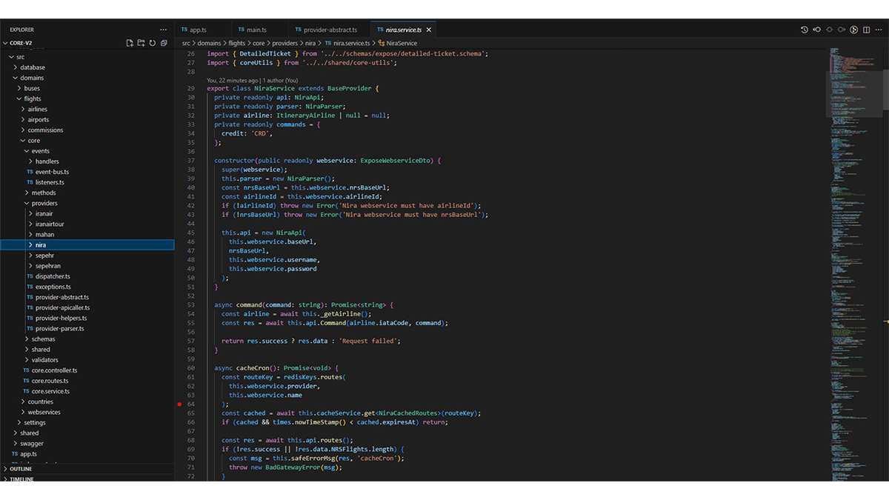
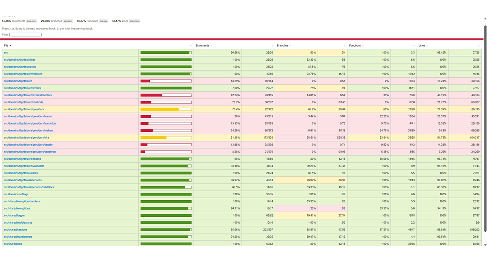
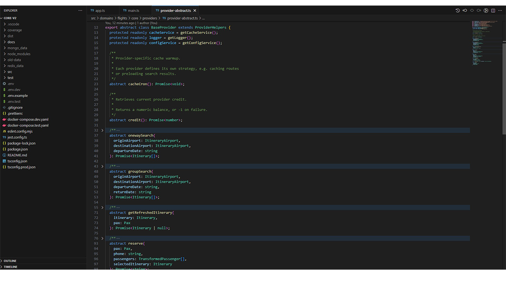
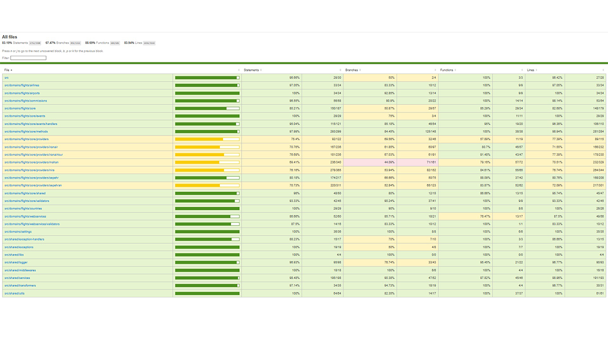

# Azarbilit – Flight Booking Platform

> **Status:** Former Backend Developer | Production Systems | Private Codebase  
> **Tech Stack:** Node.js • TypeScript • Express 5 • NestJS • MongoDB • MariaDB/TypeORM • Redis • Swagger • Zod

## Overview

As a **Backend Developer** at **[Azarbilit](https://azarbilit.ir/)** (May 2025 – Present), I work on the company’s core flight booking systems.  
This includes migrating legacy services, building new APIs, and maintaining production flows handling thousands of daily requests.

While the **codebase is private**, this entry highlights my role, responsibilities, and key contributions.

---

## Key Contributions

### Legacy System Migration

- Maintained and migrated a **legacy Express.js backend** (~43 endpoints) from JavaScript to **TypeScript**
- Introduced **Zod validation** and **Swagger documentation** for cleaner, safer APIs
- Worked directly with **OpenTravel SOAP/XML APIs** (e.g., Mahan, IranAir) to integrate provider data into our booking flow
- Integrated with **Nira**, a poorly structured provider where all responses arrive as raw strings:
  - Built **regex-based extractors** and transformation pipelines
  - Normalized outputs into structured, typed data for internal use
- Designed **custom reusable objects** (Itinerary, Slice, Segment) as a consistent internal schema
  - Providers only “fill the shape” — the rest of the system consumes our clean abstractions
- Introduced a **fault-tolerant search pipeline**:
  - Reduced redundant provider calls with **caching** and **cron jobs**
  - Supported **high-load conditions** by spreading and limiting provider I/O
- Established **testing from day one** for version 2:
  - Added **unit and integration tests** despite challenges like:
    - Providers with **no sandbox environments**
    - **IP whitelisting restrictions** making automated tests difficult
  - Developed **mocked provider responses** to simulate edge cases safely

---

### Main Service Maintenance (NestJS)

- Inherited a **3+ year production service with no migrations**
- Designed and executed a migration strategy:
  - Recreated **initial migration** to align database schema with TypeORM entities
  - Carefully tested migration scripts locally to prevent production downtime
- Fixed critical issues:
  - **Price overflows** due to `INT(11)` fields (Iran’s inflation made prices exceed limits) → migrated to safer types to handle 3B+ IRR values
  - Migrated card number → **IBAN (Shaba)** with reusable validators and transformers
  - Fixed “permanent IBAN verification” bug that allowed invalid accounts
- Navigated legacy challenges:
  - **God functions**, hardcoded values, and no documentation
  - Required extreme caution — **every change reviewed and tested multiple times** before production
- Improved maintainability:
  - Added **Swagger docs** for endpoints
  - Planned and executed **gradual refactors** to untangle the codebase

---

### Testing & Reliability

- Built **integration tests** with Supertest (webservice + commission modules)
- Created a **provider fault-tolerance layer** so failing providers don’t break the entire booking/search flow
- Established a **baseline test suite** where none previously existed

---

### Deployment & Infrastructure

- Collaborated with Git workflows (PRs, code reviews)
- Helped maintain production uptime and stability in a **small two-person backend team**

---

## Screenshots & Artifacts

Here’s where I can share visuals that demonstrate my work:

- **Swagger UI examples** (documented endpoints)
- **Integration test coverage reports**
- **Architecture diagrams** of provider → system pipelines
- **Code excerpts** (non-sensitive, e.g., reusable validators/transformers)

---

## Lessons & Growth

- Learned to balance **new development with legacy code maintenance**
- Deepened knowledge of **SOAP/XML systems** and how to normalize them into REST-like APIs
- Improved skills in **designing resilient systems** that survive unreliable providers
- Built strong habits of **testing, migration planning, and code safety** in production systems
- Gained real-world collaboration experience with **PRs, reviews, and daily coordination**

---

### 🔙 [Back to Project Index](../README.md)
