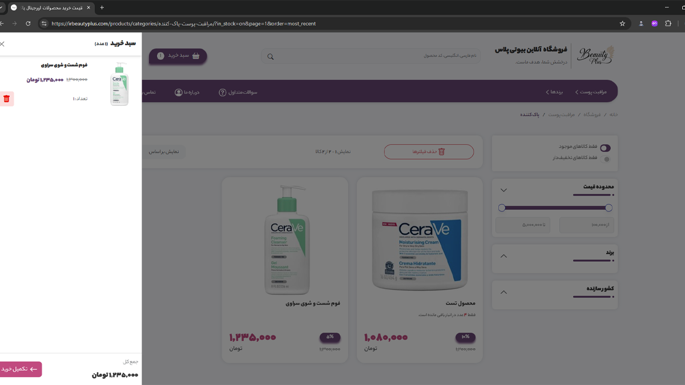

# BeautyPlus – Skincare E-Commerce Platform

> **Status:** Production-Ready | Temporarily Offline (can be relaunched on demand)  
> **Tech Stack:** Django | PostgreSQL | Docker | Nginx | Cloudflare SSL | HTML | CSS | JavaScript | jQuery

---

## Overview

A full-featured e-commerce platform built with Django, designed for real-world deployment.  
It includes OTP-based authentication, recursive product categories, and dedicated user/admin panels.

The platform was successfully deployed to production and **can be brought back online at:**  
[irbeautyplus.com](https://irbeautyplus.com) _(currently offline)_

---

## Key Features

### Authentication System

- **OTP-based login** via phone numbers - passwordless and secure

### Modular E-Commerce Backend

- **Recursive product categories** using MPTT
- **Extensible Core Apps:** Products, Carts, Orders, Notifications, Tags, Accounts

### Project Structure & Design Philosophy

- **Modular code structure**: models, forms, and admin split for maintainability
- Introduced a **service layer (singleton per model)** to isolate business logic
  - Inspired by **NestJS** best practices
  - Decouples apps, easier testing & reuse

### SEO & Social Media Optimization

- Auto-generated **meta tags** for products, brands, categories
- Dynamic **Open Graph images (og:image)**
- Rich **JSON-LD schema markup** for products
- Fully managed **sitemap generation**
- Smart hierarchical slugs for SEO-friendly URLs

### Deployment & Infrastructure

- **Dockerized** for consistent deployments
- **Nginx reverse proxy + Certbot SSL**
- **Cloudflare DNS** for performance & security
- **Cron jobs** for maintenance

### Backup & Disaster Recovery

- Automated **encrypted daily backups** to Google Drive via `rclone`
- Versioned backups ensuring data integrity

---

## Screenshots

---

## Access or Demo

Codebase is private.  
Contact me for an **architecture walkthrough or live demo re-deployment**.

    
    
    
    

---

## Lessons & Next Steps

- Mastered **GenericForeignKey/ContentType/GenericRelation** in Django
- Ultimately preferred **explicit inheritance over magic** for clarity:
  - Ratings via a `BaseRate` model → extended per type (`ProductRate`, `BlogRate`, etc.)
  - Same for categories (`BaseCategory` → `ProductCategory`, `BlogCategory`, etc.)
- Tradeoff: slightly more boilerplate, but **cleaner queries, admin integration, and long-term maintainability**
- Learned to run Django in **real production deployments**
- Future roadmap:
  - Order flow refinements
  - Improved admin UX
  - Relaunch live instance

---

### 🔙 [Back to Project Index](../README.md)
