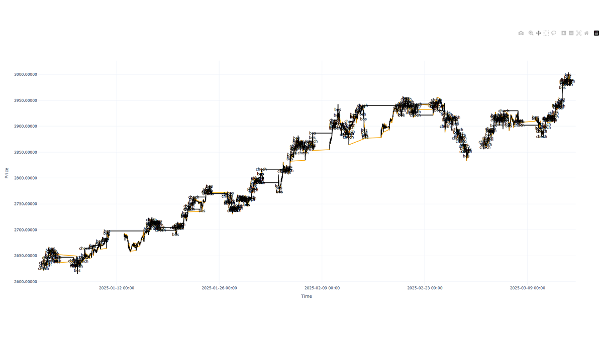
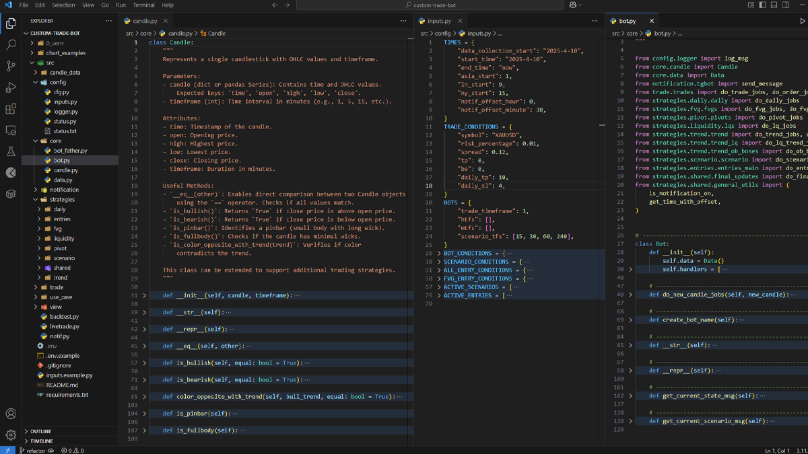
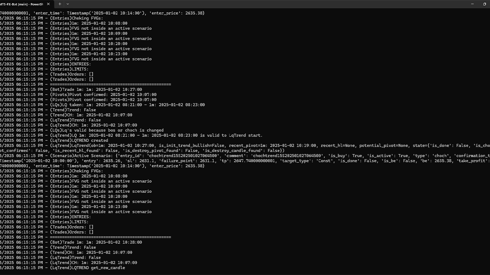
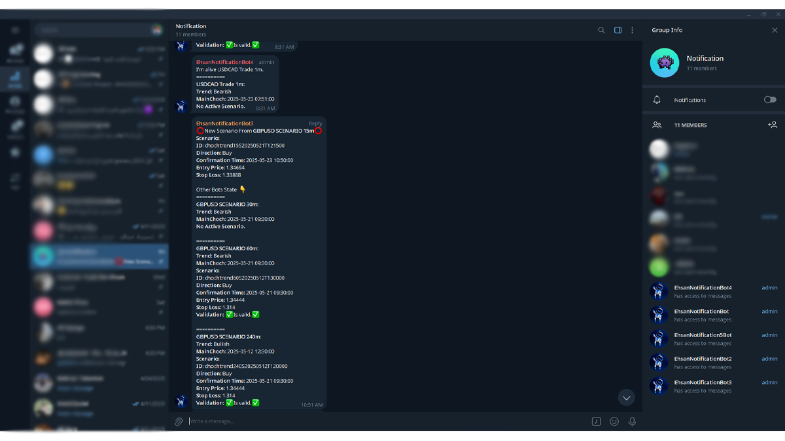

# 🤖 Custom Trade Bot

> **Status:** ✅ Live | 🧪 In Development | 🔒 Private Codebase  
> **Tech Stack:** Python • MetaTrader5 • Plotly

---

## 🧾 Overview

Custom Trade Bot is a Python-based trading bot built for **both live trading and backtesting** with full **MetaTrader5 integration**.

It’s built around a custom trading strategy and includes **modular components** for signal generation, dynamic order handling, and bot control — making it highly adaptable to different market conditions.

While the codebase is private, screenshots are provided and a walkthrough can be provided on request.

---

## 🧩 Key Features

### 💹 MetaTrader5 Integration
- Connects to **MetaTrader5** for real-time market data, order placement, and account tracking.
- Efficient handling of broker interactions and API edge cases.

### 🧠 Strategy & Logic
- Executes trades based on **client-defined entry conditions** and signals
- Supports **custom structures** like:
  - Fair Value Gaps (FVG)
  - Liquidity
  - Trend 
  - Multi-factor entry signals

### 🛠️ Custom Order Handling
- Flexible logic to generate **market and limit orders**
- Dynamic control over:
  - **Lot sizing**
  - **Stop-loss / Take-profit**
  - Conditional re-entry and risk settings

### 🧪 Dual Modes: Live + Backtest
- Backtest strategies on historical data with consistent execution logic
- Seamless switch to **live mode** using the same config and entry logic

### 🔄 Real-Time Control System
- Behavior is controlled by a `status.txt` file for:
  - Emergency shutdowns (`kill all`)
  - Enabling/disabling trading without restarting
  - Fine-tuned debug and verbosity levels

### 📊 Logging & Visualization
- Real-time logging of decisions and trades
- Performance analytics and **backtest visualizations** using **Plotly**

### 🔧 Current Status & Refactor Notes
- Live trading functionality is disabled for now; bot is in **notification-only mode**
- Codebase is being **refactored for better modularity and separation of concerns**
- Screenshots of current Telegram alerts and the improved code structure are included
---

## 📸 Screenshots

---

## 🤝 Access or Demo

    Contact me if you'd like access or a walkthrough of the architecture.
    
    
    
    

I’m open to collaborations, freelance opportunities, or contributions under NDA.

---

## 🧠 Lessons & Next Steps

- Delivered a working bot that met all client requirements for live trading on a demo account
- Learned how to build a fault-tolerant system for **real-world trading**, including exception handling, session control, and real-time monitoring
- Currently used as a **signal-notification system**: Five bot instances are running on different Forex pairs, pushing alerts to a Telegram group when predefined "scenarios" are met
- Client applies additional filters manually before executing trades based on received signals

### 📦 Related Project: [OHLCraft](https://github.com/SamEag1e/OHLCraft)

> This project inspired the creation of **OHLCraft**, a WIP open-source framework for building modular trading bots.  
> [View the OHLCraft showcase](../portfolio/ohlcraft/overview.md) _(link once it's added)_

### 🔙 [Back to Project Index](../README.md)
