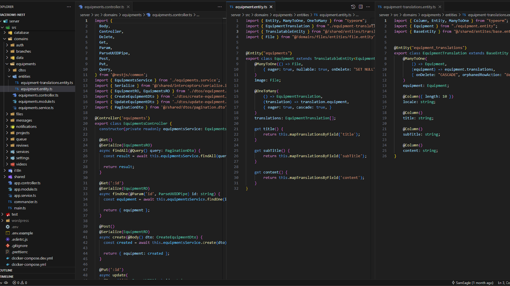
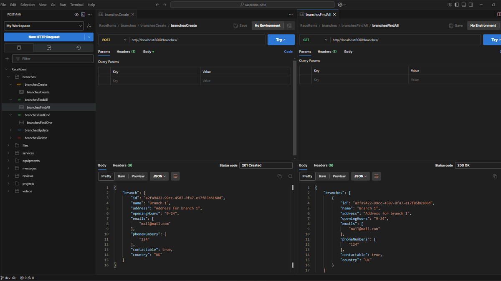

# Raceroms

> **Status:** Live | In Active Development  
> **Tech Stack:** NestJS • TypeORM • PostgreSQL

---

## Overview

Raceroms is a real-world platform focused on chip tuning and ECU remapping services for a wide range of vehicles — including cars, motorcycles, and trucks.

Built in collaboration with [`Saeed`](https://github.com/sa8ab), I contributed backend modules to support the data infrastructure behind vehicle configurations and service management.

**Live at:** [raceroms.com](https://raceroms.com)

---

## Key Features

### Vehicle Data Management (via Crawling)

- Core data (brands, models, tuning specs) is **automatically populated by crawlers** pulling from third-party sources
- Backend structured to handle and serve this dynamic, growing dataset efficiently

### Backend Architecture (My Contribution)

- **DTOs, Services, and Controllers** for several modules
- Structured using **NestJS** with a modular, service-oriented approach
- Developed clean, maintainable APIs for internal and future public usage

### Multilingual & Region-Aware

- Supports multiple languages including **English**, **Greek**, and **Bulgarian**
- Tailors tuning data and vehicle info based on regional specifications and availability

---

## Screenshots

---

## Access or Demo

The project is private.

    Contact me if you'd like access or a walkthrough of the architecture.
    
    
    
    

---

## Lessons & Next Steps

- Gained hands-on experience contributing to a **real production-grade NestJS backend**
- Practiced building clear Entity–DTO–Service pipelines in a collaborative Git workflow

### 🔙 [Back to Project Index](../README.md)
