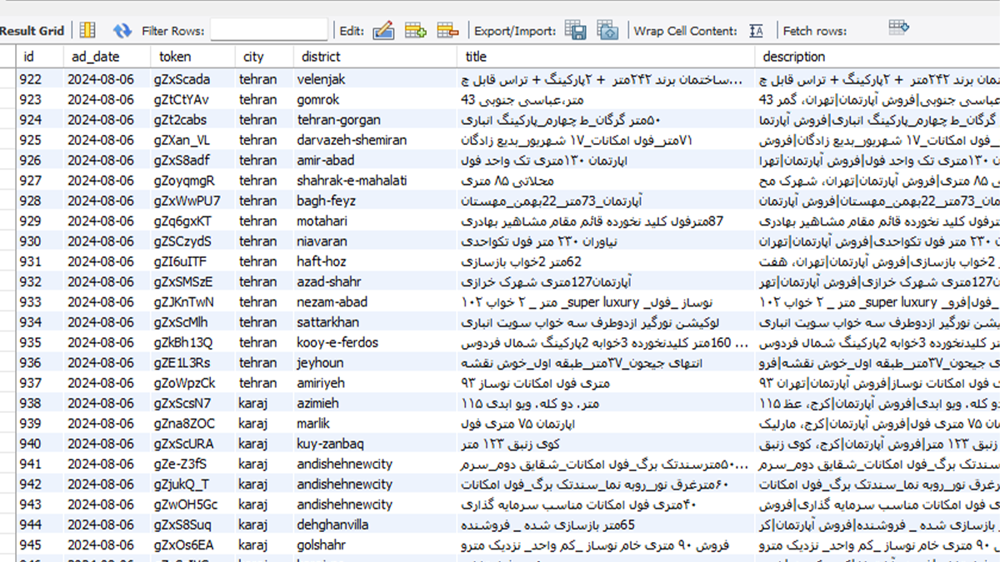
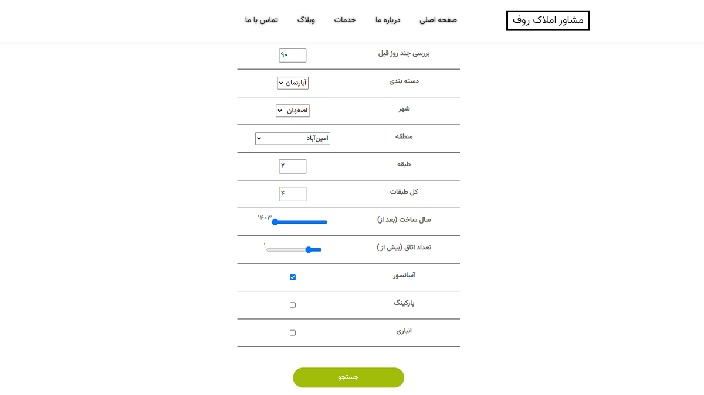
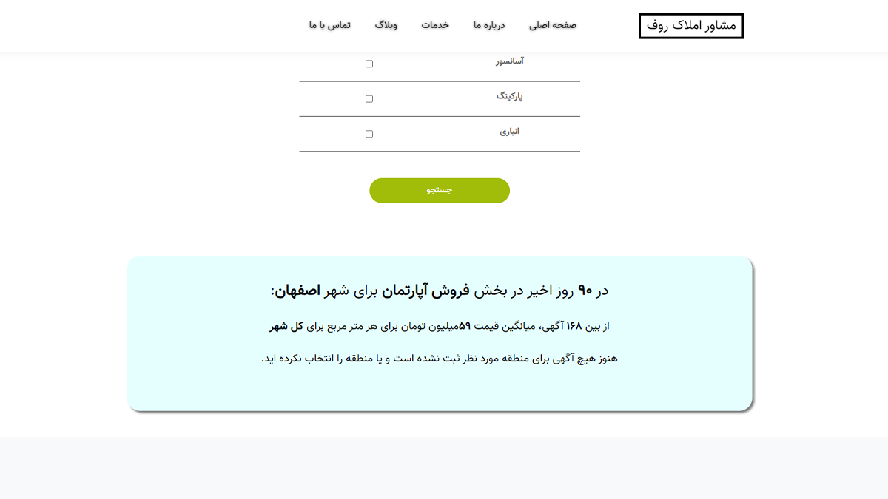
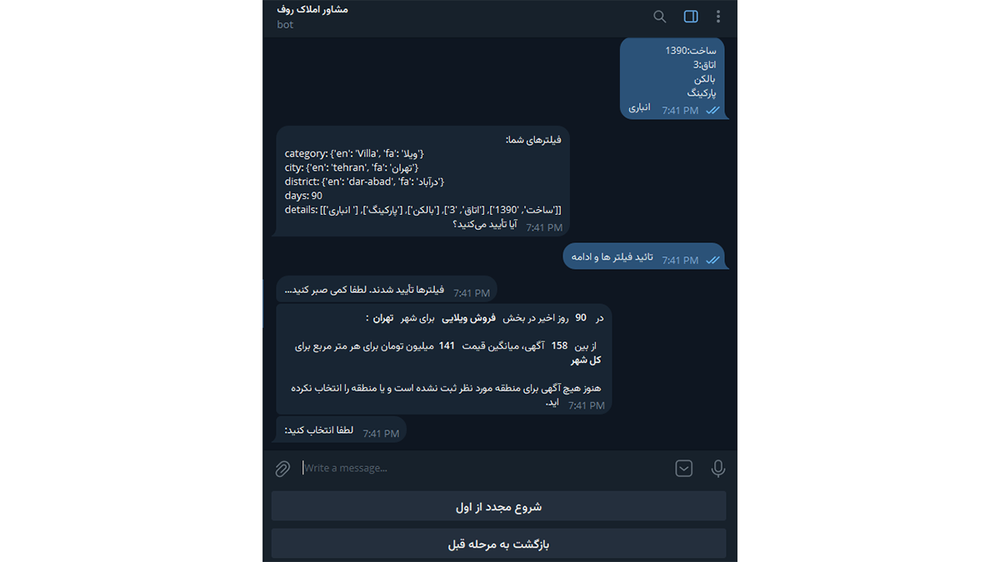

# Roof Estimator (Archived Learning Project)

> **Status:** Archived • Experimental • Codebase Public  
> **Tech Stack:** Python • Django • Telegram Bot API • MySQL • Scrapy/Selenium • Divar API

---

## Overview

This multi-phase project was my deep dive into data extraction, simple web app design, and bot-based user interfaces - all centered around one real-world goal: **estimate property prices from Divar listings.**

It started with scraping, pivoted to API-based collection, and eventually grew into a Django frontend and a Telegram bot for price queries. While none of the components are live or production-grade now, this archive captures my first end-to-end attempt at solving a real problem.

---

## Key Features

### Data Collection & Storage

- Initial attempt using **Scrapy + Selenium** (abandoned for performance and stability)
- Switched to **Divar's public API**, resulting in a fast, stable data crawler
- Stored data in MySQL using a **hand-rolled mini ORM**

### Analysis & Web Interface

- Built a **Django app** for calculating average price per meter
- Users could filter by location, category, and area
- Included blog, contact, and simple admin section (early learning effort)

### Telegram Bot for End Users

- Created a simple bot interface for real estate agents
- Users could get average price estimates directly in Telegram
- Supported basic filters and returned instant price metrics

---

## Screenshots

---

## Access or Demo

Codebases are archived but publicly available:

- [Divar-Scrapy-Selenium](https://github.com/SamEag1e/Divar-Scrapy-Selenium)
- [Divar-API-Crawler](https://github.com/SamEag1e/Divar-API-Crawler)
- [dj-RoofRealEstate](https://github.com/SamEag1e/dj-RoofRealEstate)
- [tgbot-RoofRealEstatePrice](https://github.com/SamEag1e/tgbot-RoofRealEstatePrice)

---

## Lessons & Next Steps

- Learned the fundamentals of Scrapy, Selenium, and building a simple ORM from scratch
- Learned Django by hacking this together from scratch
- Telegram bots became a fun way to deliver utility

No plans to revive or maintain this, but the **idea still holds value**, and someday a cleaner version might resurface.

### 🔙 [Back to Project Index](../README.md)
